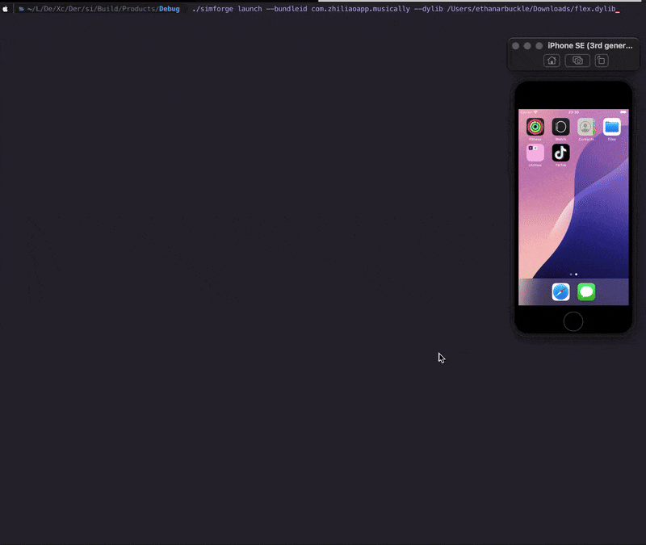

# simforge: Run iOS Apps on Apple Silicon Simulators

simforge is a tool that enables running ARM64 iOS apps on Apple Silicon iOS simulators by modifying the Mach-O binary headers to indicate simulator compatibility.


### Usage

```
Usage: simforge <command> [options]

Commands:
  convert     Add Simulator support to iOS arm64 mach-o binaries
  launch      Launch app in Simulator with dylib injection
  makerw      Create a read-write overlay of a directory

Convert:
  simforge convert <path>    Convert iOS app/dylib for simulator (breaks codesig)

Launch:
  simforge launch --bundleid <id> --dylib <path>

Make Read-Write:
  simforge makerw <path>     Create RW overlay of directory while retaining contents

Examples:
  simforge convert /path/to/MyApp.app
  simforge convert /path/to/tweak.dylib
  simforge launch --bundleid com.example.app --dylib /path/to/tweak.dylib
  simforge makerw "iOS 18.1.simruntime/.../RuntimeRoot/System/Library/CoreServices/SpringBoard.app"
```

### Running an iOS App in Simulator


#### 1. Prepare the Decrypted App

Start with a decrypted build of the iOS app you want to run in the simulator.

#### 2. Extract the IPA

Extract the `.app` bundle from the IPA:

```bash
unzip /path/to/your-app-decrypted.ipa -d /path/to/destination/
```

This will create a `Payload` directory containing the `.app` bundle.

#### 3. Convert for Simulator

Run `simforge convert` on the extracted `.app` bundle:

```bash
simforge convert /path/to/Payload/YourApp.app
```

simforge will find all Mach-O binaries in the app bundle and modify their headers (in place) to indicate simulator compatibility

##### Example `simforge convert` Output

```bash
simforge convert ./app-decrypt-com.zhiliaoapp.musically9bm7fcnv.app
Successfully converted: app-decrypt-com.zhiliaoapp.musically9bm7fcnv.app/PlugIns/AWEVideoWidget.appex/AWEVideoWidget
Successfully converted: app-decrypt-com.zhiliaoapp.musically9bm7fcnv.app/PlugIns/AwemeShareExtension.appex/AwemeShareExtension
Successfully converted: app-decrypt-com.zhiliaoapp.musically9bm7fcnv.app/PlugIns/AwemeBroadcastExtension.appex/AwemeBroadcastExtension
Successfully converted: app-decrypt-com.zhiliaoapp.musically9bm7fcnv.app/PlugIns/AwemeNotificationService.appex/AwemeNotificationService
Successfully converted: app-decrypt-com.zhiliaoapp.musically9bm7fcnv.app/PlugIns/TikTokIntentExtension.appex/TikTokIntentExtension
Successfully converted: app-decrypt-com.zhiliaoapp.musically9bm7fcnv.app/PlugIns/TikTokMessageExtension.appex/TikTokMessageExtension
Successfully converted: app-decrypt-com.zhiliaoapp.musically9bm7fcnv.app/PlugIns/AwemeWidgetExtension.appex/AwemeWidgetExtension
Successfully converted: app-decrypt-com.zhiliaoapp.musically9bm7fcnv.app/TikTok
```

#### 4. Code Sign the Modified App

After conversion, the app needs to be re-signed. You can simply ad-hoc sign:

```bash
# Sign frameworks first
codesign -f -s - /path/to/Payload/YourApp.app/Frameworks/*

# Then sign the main app bundle
codesign -f -s - /path/to/Payload/YourApp.app
```

#### 5. Install to Simulator

You can drag-and-drop `YourApp.app` folder into your simulator home screen to install, or install from command line:

```bash
# List available simulators
xcrun simctl list devices

# Install the app (replace UUID with your simulator's identifier)
xcrun simctl install "SIMULATOR_UUID" /path/to/Payload/YourApp.app
```

#### 6. Launch with Dylib Injection (Optional)

You can also launch an installed app with dylib injection:

```bash
simforge launch --bundleid com.example.app --dylib /path/to/tweak.dylib
```

The dylib will be automatically converted for simulator compatibility and signed if needed.

